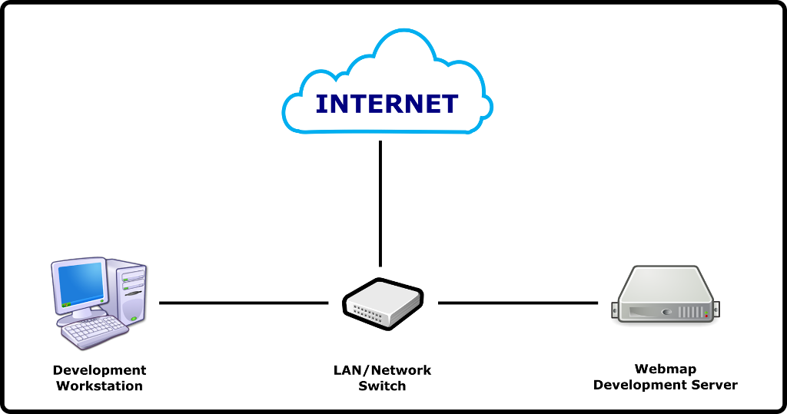

## Membangun GeoStack untuk Webmap Development Berbasis Fedora Linux


> **Asumsi \#1**: Skenario _development ecosystem_ akan kita bangun adalah:



> dimana:
> _Development workstation_ IP address: **192.168.1.2/24**, OS: **Windows 10**. Pada _workstation_ ini akan terpasang beberapa _software_ yang umum digunakan untuk webmap _development_, seperti [**Quantum GIS**](https://qgis.org/en/site/forusers/download.html), [**PostGIS Shapefile and DBF Loader/Exporter**](https://www.enterprisedb.com/downloads/postgres-postgresql-downloads), [**Microsoft Visual Studio Code**](https://code.visualstudio.com/download) (atau [**Notepad++**](https://notepad-plus-plus.org/)), [**Postman**](https://www.getpostman.com/downloads/), [**PgAdmin**](https://www.pgadmin.org/download/pgadmin-4-windows/), [**MySQL Workbench**](https://dev.mysql.com/downloads/workbench/), [**SQLite DB Browser**](https://sqlitebrowser.org/), **PuTTy**](https://www.putty.org/) dan [**WinSCP**](https://winscp.net/eng/download.php).

> Server IP address: **192.168.1.23/24**, hostname: **nusantara**, default user: **rinjani**.

> **Asumsi \#2**: Instalasi dari DVD/USB Flashdisk/ISO file (jika dijalankan di atas VirtualBox/VM Ware) sudah dilaksanakan, dengan tidak lupa untuk mengganti hostname dan setting IP address secara manual. Untuk menjalankan langkah-langkah post-install, sistem harus terhubung dengan Internet!

Berikut ini adalah langkah-langkah membangun sebuah _geostack_ berbasis Fedora Linux 29.

### Part 1: Post-Installation / OS Configuration

#### 1. Login sebagai _administrator_ user

  ```
  [rinjani@nusantara ~]$ sudo su
  
  [root@nusantara rinjani]# dnf update
  
  [root@nusantara rinjani]# reboot
  ```
  
#### 2. Disabling SELinux

Langkah ini ditempuh supaya handling _filesystem_ tidak _ribet_. Walaupun SELinux bersifat _mandatory_ untuk production server, tapi untuk sementara dapat diabaikan dulu.

  ```
  [rinjani@nusantara ~]$ sudo nano /etc/sysconfig/selinux
  ```
  
  Ubah:
  
  ```
  SELINUX=enforcing
  ```
  
  Menjadi:
  
  ```
  SELINUX=disabled
  ```
  
  \[save + exit\]
  
  ```
  [rinjani@nusantara ~]$ sudo reboot
  ```
  
  Karena SELinux nya di-_disable_, maka sekarang pengamanan server akan diserahkan pada service _firewalld_. Untuk memeriksa apakah _firewall_ sudah terinstall dan aktif, jalankan shell command:
  
  ```
  [rinjani@nusantara ~]$ sudo firewall-cmd --list-all-zones
  ```
  
  Jika service _firewalld_ belum terinstall karena suatu hal, maka langkah-langkah instalasinya adalah sebagai berikut:
  
  ```
  [rinjani@nusantara ~]$ sudo dnf install firewalld
  
  [rinjani@nusantara ~]$ sudo systemctl unmask firewalld
  
  [rinjani@nusantara ~]$ sudo systemctl enable firewalld.service
  
  [rinjani@nusantara ~]$ sudo systemctl start firewalld.service
  ```
  
#### 3. Component Installation:

  ##### 3.1. Install base components:
  
  ```
  [rinjani@nusantara ~]$ sudo dnf install wget curl git glibc binutils gcc libaio kernel-headers kernel-devel virtualenv
  ```
  
  ##### 3.2. Install OpenJDK:
  
  ```
  [rinjani@nusantara ~]$ sudo dnf install java-1.8.0-openjdk-*
  ```
  
  Test instalasi OpenJDK dengan shell command:
  
  ```
  [rinjani@nusantara ~]$ java -version
  ```
  
  ##### 3.3. Install SELinux-related components (Kalau SELinux nya diaktifkan)
  
  ```
  [rinjani@nusantara ~]$ sudo dnf install python3-policycoreutils policycoreutils-python-utils policycoreutils-devel policycoreutils-newrole policycoreutils-sandbox
  ```
  
  ##### 3.4. Install GDAL
  
  ```
  [rinjani@nusantara ~]$ sudo dnf install gdal gdal-libs gdal-devel gdal-doc gdal-java gdal-perl gdal-python3 python3-networkx-geo geos geos-devel proj proj-devel hdf5 hdf5-devel
  ```
  
  Untuk test GDAL, jalankan shell command:
  
  ```
  [rinjani@nusantara ~]$ gdalinfo --version
  ```
  
  ##### 3.5. Install GMT (Generic Mapping Tools):
  
  ```
  [rinjani@nusantara ~]$ sudo dnf install GMT GMT-common GMT-doc GMT-devel gshhg-gmt-nc4 gshhg-gmt-nc4-full gshhg-gmt-nc4-high dcw-gmt
  ```
  
  Untuk test GMT, jalankan shell command:
  
  ```
  [rinjani@nusantara ~]$ gmt
  ```
  
  atau langsung saja cek versi GMT:
  
  ```
  [rinjani@nusantara ~]$ gmt --version
  ```
  
  ##### 3.6. Install PostgreSQL base:
  
  ```
  [rinjani@nusantara ~]$ sudo dnf install postgresql postgresql-server postgresql-pgpool-II postgresql-contrib postgresql-devel postgresql-docs postgresql-pgpool-II-extensions postgresql-pgpool-II-devel postgresql-odbc postgresql-jdbc python3-postgresql postgresql-test
  ```
  
  ##### 3.7. Install PostgreSQL tools:
  
  ```
  [rinjani@nusantara ~]$ sudo dnf install pgtune pgaudit pg_top pg_view
  ```
  
  ##### 3.8. Install PostGIS, PgRouting dan OSM-related tools:
  
  ```
  [rinjani@nusantara ~]$ sudo dnf install postgis pgRouting readosm osmpbf osmpbf-java osmpbf-devel osmctools osmium-tool osm2pgsql
  ```
  
  ##### 3.9. Install MySQL Community:
  > Sebaiknya, cek terlebih dahulu versi termutakhir di situsnya MySQL.
  
  ```
  [rinjani@nusantara ~]$ sudo rpm -Uvh https://dev.mysql.com/get/mysql80-community-release-fc29-2.noarch.rpm
  
  [rinjani@nusantara ~]$ sudo dnf update
  
  [rinjani@nusantara ~]$ sudo dnf install mysql-community-server mysql-community-client mysql-community-common mysql-community-libs mysql-community-test mysql-community-devel
  ```
  
  > **Catatan**: Jika diinstall di Fedora Workstation (yang memiliki GUI Gnome 2), maka dapat juga langsung menginstall **MySQL Workbench** dan **SQLite DB Browser**:
  
  ```
  [rinjani@nusantara ~]$ sudo dnf install mysql-community-server mysql-community-client mysql-community-common mysql-community-libs mysql-community-test mysql-community-devel mysql-workbench-community sqlitebrowser
  ```
  
  ##### 3.10. Install Apache Tomcat:
  
  ```
  [rinjani@nusantara ~]$ sudo dnf install tomcat tomcat-webapps tomcat-admin-webapps
  ```
  
  ##### 3.11. Install PHP
  
  ```
  [rinjani@nusantara ~]$ sudo dnf install php php-fpm php-devel php-bcmath php-dba php-dbg php-exif php-gd php-gmp php-interbase php-mbstring php-pecl-mcrypt php-mysqlnd php-odbc php-opcache php-pdo php-pdo-dblib php-pear php-pecl-selinux php-pecl-redis php-pgsql php-process php-soap php-xml php-xmlrpc
  ```
  
  ##### 3.12. Install other components/software:
  
  ```
  [rinjani@nusantara ~]$ sudo dnf install composer samba* nginx pure-ftpd nodejs golang
  ```

:grin: Sampai pada tahap ini, _geostack_ Anda sudah siap untuk dikonfigurasi seluruh komponen terkait nya.

> Instalasi dan konfigurasi sebuah _tech-stack_ adalah sebuah _craftmanship_ -- semakin mendalam Anda memahami bagaimana sebuah komponen bekerja dalam ekosistemnya, _in-and-out_, maka semakin paham pula Anda terhadap seluruh ketidaksempurnaan yang pernah Anda jumpai dalam hidup.

### Related parts:
  * Part 1: Post-Installation / OS Configuration (this file)
  * [Part 2](./fedora-geostack-part-2-apache-tomcat.md): Configuring Apache Tomcat for GeoServer
  * [Part 3](./fedora-geostack-part-3-geoserver.md): GeoServer Installation / Configuration
  * [Part 4](./fedora-geostack-part-4-postgis.md): Configuring PostgreSQL and PostGIS
