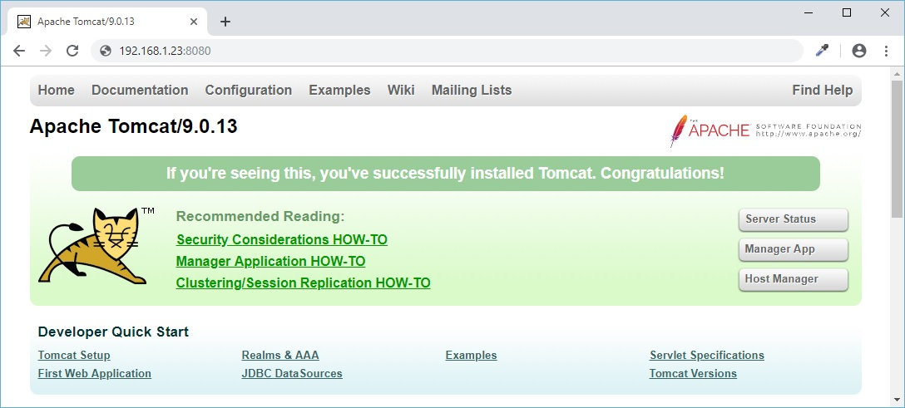

### Part 2: Configuring Apache Tomcat for GeoServer

Berikut ini adalah langkah-langkah untuk mengkonfigurasi Apache Tomcat sebagai _web container_ GeoServer.
> **Asumsi:** Apache Tomcat sudah terinstall, mengacu pada Part 1.

##### 1. Mengganti _password_ Tomcat Webapps Admin:
  
  ```
  [rinjani@nusantara ~]$ sudo nano /etc/tomcat/tomcat-users.xml
  ```
  
  _Enable_ semua _entries_ dalam _tag_ ```<tomcat-users ... > ... </tomcat-users>``` menjadi:
  
  ```
  <tomcat-users ... >
  ...
  
    <role rolename="admin"/>
    <role rolename="admin-gui"/>
    <role rolename="admin-script"/>
    <role rolename="manager"/>
    <role rolename="manager-gui"/>
    <role rolename="manager-script"/>
    <role rolename="manager-jmx"/>
    <role rolename="manager-status"/>
    <user name="[--ubah-sekehendak-Anda--]" password="[--ubah-sekehendak-Anda--]" roles="admin,manager ... manager-status"/>
  </tomcat-users>
  ```
  
  \[save + exit\]
  
##### 2. Men-_disable_ tag ```<Valve ... />``` pada _manager_ dan _host-manager_ supaya dapat diakses dari luar _localhost_:

> **Catatan:** Jangan lakukan ini pada production server!

  ```
  [rinjani@nusantara ~]$ sudo nano /var/lib/tomcat/webapps/manager/META-INF/context.xml
  ```
  
  Ubah:
  
  ```
    <Context antiResourceLocking="false" privileged="true">
      <Valve className="org.apache.catalina.valves.RemoteAddrValve"
        allow="127\.\d+\.\d+\.\d+|::1|0:0:0:0:0:0:0:1" />
      <Manager sessionAttributeValueClassNameFilter="java\.lang\. ... ?HashMap"/>
    </Context>
  ```
  
  Menjadi:
  
  ```
    <Context antiResourceLocking="false" privileged="true">
      <!-- <Valve className="org.apache.catalina.valves.RemoteAddrValve"
        allow="127\.\d+\.\d+\.\d+|::1|0:0:0:0:0:0:0:1" /> -->
      <Manager sessionAttributeValueClassNameFilter="java\.lang\. ... ?HashMap"/>
    </Context>
  ```
  
  \[save + exit\]
  
  ```
  [rinjani@nusantara ~]$ sudo nano /var/lib/tomcat/webapps/host-manager/META-INF/context.xml
  ```
  
  dan lakukan hal sama seperti di langkah sebelumnya.
  
##### 3. Membuka _port_ 8080 dan 8009 di service _firewalld_:

Hal ini dilakukan supaya seluruh fitur Apache Tomcat dapat diakses dari luar, selain dari _localhost_.

> **Catatan:** Jangan lakukan ini pada production server! Apache Tomcat lebih baik di-_reverse-proxy_ melalui Nginx.

  ```
  [rinjani@nusantara ~]$ sudo firewall-cmd --permanent --zone=FedoraServer --add-port=8080/tcp
  
  [rinjani@nusantara ~]$ sudo firewall-cmd --reload
  
  [rinjani@nusantara ~]$ sudo firewall-cmd --permanent --zone=FedoraServer --add-port=8009/tcp
  
  [rinjani@nusantara ~]$ sudo firewall-cmd --reload
  ```
  
##### 4. Mengaktifkan Apache Tomcat sebagai _service daemon_ supaya bisa _autostart_ pada saat server reboot:

  ```
  [rinjani@nusantara ~]$ sudo systemctl enable tomcat.service
  ```
  
  Untuk mengaktifkan, jalankan shell command:
  
  ```
  [rinjani@nusantara ~]$ sudo systemctl start tomcat.service
  ```
  
  Untuk memastikan Apache Tomcat sudah berjalan dan berfungsi secara keseluruhan, buka browser Anda dan buka URL ```http://localhost:8080``` atau ```http://192.168.1.23:8080```.
  
  
  
  Jika _landing page_ Apache Tomcat sudah muncul, akses juga **Server Status**, **Manager App** dan **Host Manager** untuk memastikan apakah fitur-fitur tersebut sudah befungsi atau belum.
  
  :grin: Hingga pada tahap ini _geostack_ Anda sudah siap untuk instalasi GeoServer.

> Instalasi dan konfigurasi sebuah _tech-stack_ adalah sebuah _craftmanship_ -- semakin mendalam Anda memahami bagaimana sebuah komponen bekerja dalam ekosistemnya, _in-and-out_, maka semakin paham pula Anda terhadap seluruh ketidaksempurnaan yang pernah Anda jumpai dalam hidup.
  
### Related parts:
  * [Part 1](./README.md): Post-Installation / OS Configuration
  * Part 2: Configuring Apache Tomcat for GeoServer (this file)
  * [Part 3](./fedora-geostack-part-3-geoserver.md): GeoServer Installation / Configuration
  * [Part 4](./fedora-geostack-part-4-postgis.md): Configuring PostgreSQL and PostGIS
