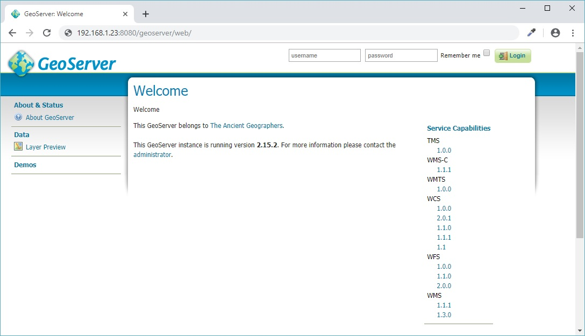
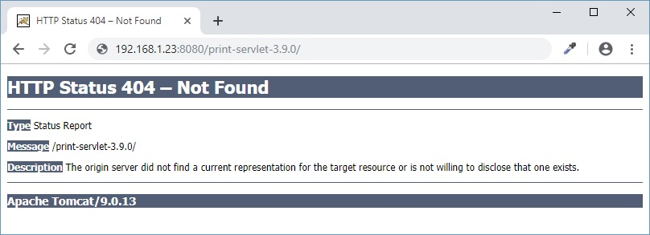
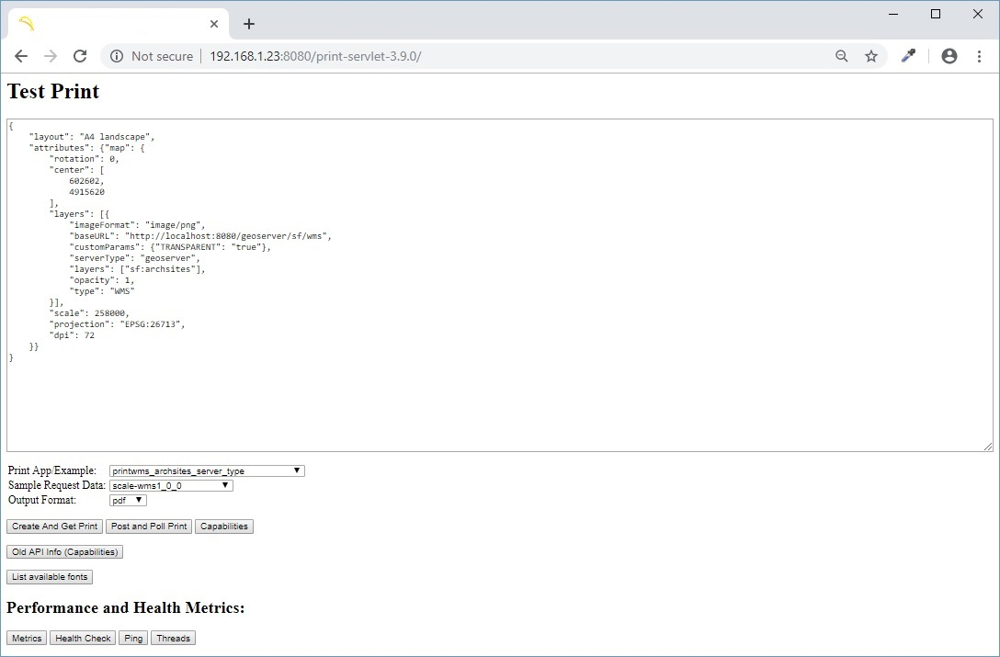

### Part 3: GeoServer Installation / Configuration

Berikut ini adalah langkah-langkah instalasi GeoServer pada Apache Tomcat.
> **Asumsi:** Apache Tomcat sudah terinstall (mengacu pada Part 1), dan sudah berjalan sebagai _service daemon_ (mengacu pada Part 2).

> GeoServer yang di-_deploy_ adalah versi GeoServer yang dijalankan di dalam _web container_ Apache Tomcat (format file: *.war).

##### 1. Stop dulu _service_ Apache Tomcat-nya:

  ```
  [rinjani@nusantara ~]$ sudo systemctl stop tomcat.service
  ```
  
  dan _download_ GeoServer versi _stable_ termutakhir dari [GeoServer.org](http://geoserver.org/release/stable/):
  
  ```
  [rinjani@nusantara ~]$ wget http://sourceforge.net/projects/geoserver/files/GeoServer/\[version\]/geoserver-\[version\]-war.zip
  ```
  
  > Upayakan untuk selalu men-_download_ versi termutakhir. Jadi, selalu cek URL _download_ di atas.
  
##### 2. Ekstrak file ```geoserver.war```, pindahkan ke direktori ```/var/lib/tomcat/webapps```, dan ubah _file permission_-nya:

  ```
  [rinjani@nusantara ~]$ unzip geoserver-\[version\]-war.zip
  
  [rinjani@nusantara ~]$ sudo mv geoserver.war /var/lib/tomcat/webapps/geoserver.war
  
  [rinjani@nusantara ~]$ sudo chown tomcat:tomcat /var/lib/tomcat/webapps/geoserver.war
  
  [rinjani@nusantara ~]$ sudo chmod 777 /var/lib/tomcat/webapps/geoserver.war
  ```

##### 3. _Start_ Apache Tomcat

  ```
  [rinjani@nusantara ~]$ sudo systemctl start tomcat.service
  ```
  
  Tunggu 5-10 detik, dan akses GeoServer melalui _browser_ pada URL ```http://localhost:8080/geoserver/``` atau ```http://192.168.1.23:8080/geoserver/```.
  
  
  
  > _By default_, untuk login pertama kali ke GeoServer gunakan _username_: **admin**, _password_: **geoserver**.
  
  > Selalu ganti _password_ untuk **master** dan **admin**, jika GeoServer direncanakan untuk bisa diakses secara publik melalui Internet.
  
  > Supaya direktori ```webapps``` Anda tetap bersih, Anda boleh men-_delete_ file ```geoserver.war```-nya.
  
  ```
  [rinjani@nusantara ~]$ sudo systemctl stop tomcat.service
  
  [rinjani@nusantara ~]$ sudo rm -rf /var/lib/tomcat/webapps/geoserver.war
  
  [rinjani@nusantara ~]$ sudo systemctl start tomcat.service
  ```
  
Apakah hanya GeoServer saja? Tidak! Suatu saat Anda akan, atau malah sekatang sudah, membutuhkan layanan cetak peta untuk webmap Anda. Di sini Anda bisa menggunakan [MapFish Print](https://mapfish.github.io/mapfish-print-doc/index.html). Untuk download_-nya, Anda bisa memilih versi termutakhir dari [Maven repository](http://repo1.maven.org/maven2/org/mapfish/print/print-servlet/). Langsung kita mulai saja, dengan mengubah mode akses sebagai _superuser_:

  ```
  [rinjani@nusantara ~]$ sudo systemctl stop tomcat.service
  
  [rinjani@nusantara ~]$ sudo su
  
  [root@nusantara rinjani]# wget http://repo1.maven.org/maven2/org/mapfish/print/print-servlet/3.9.0/print-servlet-3.9.0.war
  
  [root@nusantara rinjani]# cp print-servlet-3.9.0.war /var/lib/tomcat/webapps/print-servlet-3.9.0.war
  
  [root@nusantara rinjani]# chmod 755 /var/lib/tomcat/webapps/print-servlet-3.9.0.war
  
  [root@nusantara rinjani]# chown tomcat:tomcat /var/lib/tomcat/webapps/print-servlet-3.9.0.war
  
  [root@nusantara rinjani]# systemctl start tomcat.service
  ```
  
  Jika Anda mengakses URL ```http://localhost:8080/print-servlet-3.9.0/``` atau ```http://192.168.1.23:8080/print-servlet-3.9.0/```, maka Anda akan menjumpai Apache Tomcat _404 page_!
  
  
  
  _Nggak usah_ panik, print servlet Anda hanya kurang aplikasi implementasinya. _Engine_-nya sendiri pasti sudah berjalan secara normal. Oleh sebab itu, mari kita sempurnakan instalasi/konfigurasinya.
  
  ```
  [root@nusantara rinjani]# systemctl stop tomcat.service
  
  [root@nusantara rinjani]# rm -rf /var/lib/tomcat/webapps/print-servlet-3.9.0.war
  ```
  
  Download dari salah satu repositori publik berikut:
  
  ```
  [root@nusantara rinjani]# wget https://gitlab.com/andyprasetya/missing-files/raw/master/files/print-apps.zip
  ```
  
  Alternatif:
  ```
  [root@nusantara rinjani]# wget https://raw.githubusercontent.com/andyprasetya/webmap-development-server/master/files/print-apps.zip
  
  [root@nusantara rinjani]# unzip print-apps.zip
  ```
  
  Sekarang kita memiliki sebuah direktori ```print-apps```. Beralih ke direktori instalasi MapFish Print di Apache Tomcat ```webapps```, lihat _default_ konfigurasi direktori implementasinya dengan menjalankan _shell command_:
  
  ```
  [root@nusantara rinjani]# less /var/lib/tomcat/webapps/print-servlet-3.9.0/WEB-INF/mapfish-print-printer-factory.xml
  ```
  
  _File_ XML ini sangat mudah dibaca dan dipahami, karena Anda tinggal membaca _value_ dari _appsRootDirectory_, yang _by default_ adalah:
  
  ```
  <?xml version="1.0" encoding="UTF-8"?>
  ...
    <property name="appsRootDirectory" value="servlet:///print-apps" />
  ...
  ```
  
  Ini berarti kita harus _create_ sebuah aplikasi direktori implementasi dalam _root directory_-nya, yaitu ```print-apps```. Karena kita sudah memilikinya dari hasil ekstrak ```print-apps.zip``` di langkah sebelumnya, maka kita tinggal meng-_copy_ nya ke _root_ direktori ```print-servlet-3.9.0```. Untuk melakukannya, keluar dulu dari tampilan ```less``` dengan menekan tombol **q**, dan jalankan:

  ```
  [root@nusantara rinjani]# cp -R print-apps /var/lib/tomcat/webapps/print-servlet-3.9.0/print-apps
  ```
  
  _Set permissions_-nya sekali lagi:
  
  ```
  [root@nusantara rinjani]# chmod -R 755 /var/lib/tomcat/webapps/print-servlet-3.9.0/print-apps
  
  [root@nusantara rinjani]# chown -R tomcat:tomcat /var/lib/tomcat/webapps/print-servlet-3.9.0/print-apps
  ```
  
  Ada baiknya juga, sebelum Apache Tomcat-nya kita _start_, dibersihkan dulu _application cache_-nya, dengan _command_:
  
  ```
  [root@nusantara rinjani]# rm -rf /var/cache/tomcat/work/Catalina/localhost/print-servlet-3.9.0
  ```
  
  Baru kemudian _start_ Apache Tomcat-nya:
  
  ```
  [root@nusantara rinjani]# systemctl start tomcat.service
  ```
  
  Sekarang cek ke URL ```http://localhost:8080/print-servlet-3.9.0/``` atau ```http://192.168.1.23:8080/print-servlet-3.9.0/```, maka MapFish Print-nya sudah bisa berjalan normal.
  
  
  
  Anda bisa mencoba melakukan _print request_ dengan menyesuaikan _baseURL_-nya sesuai dengan URL GeoServer dan nama _workspace_ di dalamnya.
  
  _Milestone_ dari _roadmap_ Part 3 ini adalah instalasi dan konfigurasi **Tile Server** alternatif. Tetapi karena GeoServer sudah memiliki kemampuan untuk _serving tiles_, maka lebih baik pembahasan Tile Server alternatif akan kita laksanakan pada bagian lain yang lebih lanjut. Sekedar rekomendasi, Tile Server alternatif yang sudah cukup _mature_ adalah [Tegola](https://tegola.io/) dan [Tilestrata](https://github.com/naturalatlas/tilestrata).
  
:grin: Sampai pada tahap ini, **GeoServer**, **MapFish Print** pada _geostack_ Anda sudah berfungsi sebagaimana seharusnya, walaupun belum "_nyaman-nyaman banget_" kalau digunakan, karena URL untuk mengakses seluruh layanan di GeoServer masih mengandung **_:8080_**. Pada bagian selanjutnya nanti akan kita bahas salah satu strategi pemanfaatan GeoServer secara publik, yaitu melalui _reverse-proxy_.

> Instalasi dan konfigurasi sebuah _tech-stack_ adalah sebuah _craftmanship_ -- semakin mendalam Anda memahami bagaimana sebuah komponen bekerja dalam ekosistemnya, _in-and-out_, maka semakin paham pula Anda terhadap seluruh ketidaksempurnaan yang pernah Anda jumpai dalam hidup.

### Related parts:
  * [Part 1](./README.md): Post-Installation / OS Configuration
  * [Part 2](./fedora-geostack-part-2-apache-tomcat.md): Configuring Apache Tomcat for GeoServer
  * Part 3: GeoServer Installation / Configuration (this file)
  * [Part 4](./fedora-geostack-part-4-postgis.md): Configuring PostgreSQL and PostGIS
