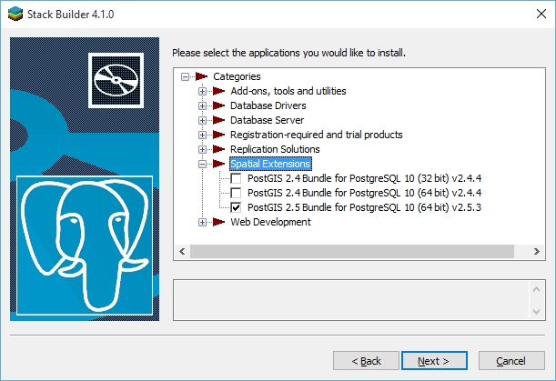
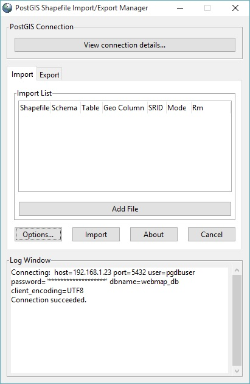
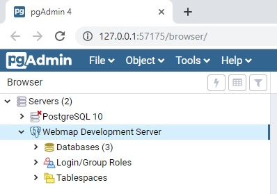
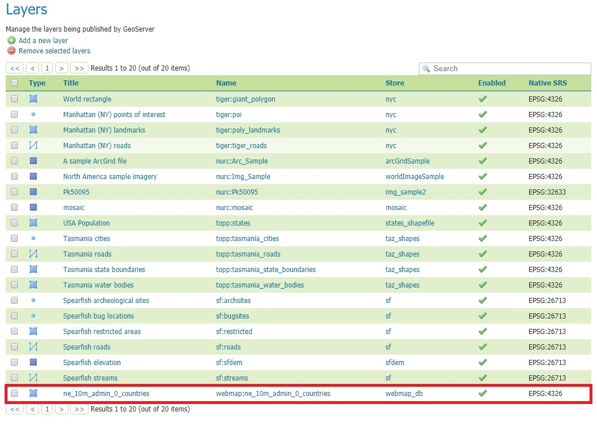

### Part 4: Configuring PostgreSQL and PostGIS

Berikut ini adalah langkah-langkah konfigurasi PostgreSQL/PostGIS setelah prosedur instalasinya selesai dilaksanakan pada [Part 1](./README.md).

#### 1. Inisiasi _built-in database_ PostgreSQL:

Setelah proses instalasi PostgreSQL (dan PostGIS, PgRouting, dll.) selesai dilaksanakan, hal pertama yang paling mendasar untuk dilakukan adalah menginisiasi _built-in database_-nya. _Command_-nya adalah sebagai berikut:

  ```
  [rinjani@nusantara ~]$ sudo postgresql-setup --initdb --unit postgresql
  
  [rinjani@nusantara ~]$ sudo systemctl enable postgresql.service
  
  [rinjani@nusantara ~]$ sudo systemctl start postgresql.service
  ```
  
  PostgreSQL sudah aktif dan siap diakses.
  
#### 2. _Create_ users (superuser dan regular user):

  Pada praktiknya, Anda akan membutuhkan 2 (dua) jenis user, yaitu **_superuser_** dan **_regular user_**. User dengan akses level _superuser_ dimanfaatkan untuk _create_, _modify_ dan _drop_ database maupun users, serta mengatur _grant access_ untuk _regular users_. Sedangkan _regular users_ digunakan untuk mengakses database dari aplikasi.

  ```
  [rinjani@nusantara ~]$ sudo su - postgres
  ```
  
  _Shell_ akan berubah menjadi:
  
  ```
  [postgres@nusantara ~]$ 
  ```
  
  Jalankan _commands_:
  
  ```
  [postgres@nusantara ~]$ createuser -sdrP pgdbadmin
  ```
  > _Parameter_ -sdrP digunakan untuk _create_ user yang _username_-nya **pgdbadmin**, dan memiliki _access privilege_ sebagai _superuser_ dan langsung _prompting password_-nya.
  > Anda akan diminta untuk memasukkan _password_ untuk user tersebut dan konfirmasinya.

  ```
  [postgres@nusantara ~]$ createuser -P pgdbuser
  ```
  > _Parameter_ -P digunakan untuk _create_ user yang _username_-nya **pgdbuser**, dan memiliki _access privilege_ sebagai _regular user_ dan langsung _prompting password_-nya.
  > Anda akan diminta untuk memasukkan _password_ untuk user tersebut dan konfirmasinya.
  
  > Untuk mengakses sebuah _database_, _regular users_ butuh _grant access_ yang dijalankan oleh _superuser_.
  
#### 3. _Create_ database _template_ (untuk PostGIS dan PgRouting):

  Masih di _shell_ yang sama, langkah berikutnya adalah membuat _template_ database yang nantinya akan digunakan sebagai _template_ database aplikasi.
  
  ```
  [postgres@nusantara ~]$ createdb postgis_template
  ```
  
  Masuk ke database _postgis_template_ yang baru saja di-_create_ dengan menggunakan _psql_ (PostgreSQL Client):
  
  ```
  [postgres@nusantara ~]$ psql -d postgis_template
  ```
  
  Maka tampilan _shell_-nya akan berubah menjadi:
  
  ```
  postgis_template-#
  ```
  
#### 4. _Create extensions_ pada _template database_:

  ```
  postgis_template-# CREATE EXTENSION postgis;
  
  postgis_template-# CREATE EXTENSION postgis_topology;
  
  postgis_template-# CREATE EXTENSION fuzzystrmatch;
  
  postgis_template-# CREATE EXTENSION address_standardizer;
  
  postgis_template-# CREATE EXTENSION pgcrypto;
  ```
  
  Jika Anda membutuhkan _extension_ PgRouting, maka tinggal jalankan:
  
  ```
  postgis_template-# CREATE EXTENSION pgrouting;
  ```
  
  Hingga tahap ini _template database_ Anda sudah memiliki seluruh _spatial-related extensions_ yang dibutuhkan.
  
  Untuk konfirmasinya, Anda bisa langsung menjalankan _commands_:
  
  ```
  postgis_template-# SELECT postgis_full_version();
  
  postgis_template-# SELECT * FROM pgr_version();
  ```
  
  Untuk keluar dan kembali ke PostgreSQL _Shell_, jalankan command:
  
  ```
  postgis_template-# \q
  ```
  
#### 5. Mengganti postgres/root _password_:

  _By default_, _password_ untuk _built-in superuser_ PostgreSQL (postgres) adalah **KOSONG** atau tidak ber-_password_. Hal ini tentu saja berbahaya bagi sistem dari segi keamanan. Oleh sebab itu, langkah-langkahnya adalah sebagai berikut:
  
  > **Catatan:** _shell_ adalah postgres, atau langsung melanjutkan dari _command_ pada bagian sebelumnya.
  
  ```
  [postgres@nusantara ~]$ psql
  ```
  
  _Shell_ yang muncul adalah:
  
  ```
  postgres-# 
  ```
  
  _Command_ nya:
  
  ```
  postgres-# \password
  ```
  
  > Anda akan diminta untuk memasukkan _password_ untuk _superuser_ **postgres** ini dan konfirmasinya.
  
  Setelah mengganti _password_ selesai, keluar ke PostgreSQL _shell_ lagi:
  
  ```
  postgres-# \q
  ```
  
  Sehingga tampilan _shell command_-nya menjadi:
  
  ```
  [postgres@nusantara ~]$ 
  ```
  
  Keluar dari PostgreSQL Client _shell_:
  
  ```
  [postgres@nusantara ~]$ exit
  ```
  
  dan _shell_-nya akan kembali menjadi:
  
  ```
  [rinjani@nusantara ~]$ 
  ```
  
#### 6. Meng-edit file konfigurasi PostgreSQL

  Ada 2 (dua) file konfigurasi utama di PostgreSQL, yaitu **_postgresql.conf_** dan **_pg_hba.conf_**. Untuk meng-edit-nya, jalankan _command_:
  
  ```
  [rinjani@nusantara ~]$ sudo systemctl stop postgresql.service
  
  [rinjani@nusantara ~]$ sudo nano /var/lib/pgsql/data/postgresql.conf
  ```
  
  Ganti:
  
  ```listen_address = 'localhost'``` menjadi: ```listen_address = '*'``` yang berarti server akan listen dari seluruh IP address yang terdaftar di _local-machine_-nya, dan
  
  ```#port = 5432``` menjadi ```port = 5432``` sehingga PostgreSQL bisa diakses melalui port 5432.
  
  Save + exit, dan edit file pg_hba.conf dengan menjalankan _command_:
  
  ```
  [rinjani@nusantara ~]$ sudo nano /var/lib/pgsql/data/pg_hba.conf
  ```
  
  Ganti _entries_ berikut ini untuk mengatur _mode_ akses dari dalam:
  
  ```
  local       all       all                     peer
  
  host        all       all     127.0.0.1/32    ident
  
  host        all       all     ::1/128         ident
  ```
  
  menjadi:
  
  ```
  local       all       all                     trust
  
  host        all       all     127.0.0.1/32    md5
  
  host        all       all     ::1/128         md5
  ```
  
  Dan tambahkan _entry_ yang disesuaikan dengan _setting_ jaringan server Anda, untuk mengatur akses dari luar, pada akhir file:
  
  ```
  host        all       all     192.168.1.0/0   md5
  ```
  
  > _Entry_ ini mengasumsikan server Anda memiliki IP address 192.168.1.xxx/24.
  
  Save + exit, buka port **5432** di _firewalld_ dan aktifkan kembali PostgreSQL:
  
  ```
  [rinjani@nusantara ~]$ sudo firewall-cmd --permanent --zone=FedoraServer --add-port=5432/tcp
  
  [rinjani@nusantara ~]$ sudo firewall-cmd --reload
  
  [rinjani@nusantara ~]$ sudo systemctl start postgresql.service
  ```

#### 7. _Create database_ dan pengaturan akses untuk _user(s)_:

  Pada dasarnya, _creating database_ adalah _create database_ berdasar _template_ yang sudah _spatially-enabled_ (yaitu **postgis_template**), dan mengatur akses untuk _user(s)_-nya . Langkah-langkahnya:
  
  ```
  [rinjani@nusantara ~]$ sudo su - postgres
  
  [postgres@nusantara ~]$ createdb webmap_db -T postgis_template -O pgdbadmin
  ```
  
  Penjelasan _command_ di atas adalah _create database_ dengan nama **webmap_db**, berdasar _template_ (**-T**) **postgis_template**, yang _owner_ (_superuser_)-nya (**-O**) **pgdbadmin**.
  
  Berikutnya, masuk ke _database_ **webmap_db** untuk mengatur akses _user_ (dalam hal ini: **pgdbuser**):
  
  ```
  [postgres@nusantara ~]$ psql -d webmap_db
  ```
  
  Dan jalankan _commands_:
  
  ```
  webmap_db=# GRANT CONNECT ON DATABASE webmap_db TO pgdbuser;
  
  webmap_db=# GRANT ALL PRIVILEGES ON DATABASE webmap_db TO pgdbuser;
  
  webmap_db=# \q
  
  [postgres@nusantara ~]$ exit
  ```
  
  Sehingga _shell command_-nya kembali menjadi:
  
  ```
  [rinjani@nusantara ~]$ 
  ```

#### 8. PostGIS Shapefile and DBF Loader/Exporter dan PgAdmin 4

  Lakukan langkah-langkah ini di workstation Anda.
  
  FYI, PostGIS Shapefile and DBF Loader/Exporter adalah sebuah aplikasi sederhana yang menjadi bagian dari paket instalasi PostGIS. Instalasi PostGIS membutuhkan PostgreSQL yang sudah terinstall (dan aktif) sebelumnya. Nah, menurut opini saya, instalasi PostgreSQL dan PostGIS di workstation _nggak_ berguna, kecuali hanya untuk _"memancing"_ instalasi **Application Stack Builder**, biar bisa install PostGIS yang mana di proses instalasinya akan mengikutkan **PostGIS Shapefile and DBF Loader Exporter**. PostgreSQL dan PostGIS _toh_ sudah ada di server. Tapi ya... mau _gimana_ lagi? _Let's just do it!_
  
  ##### 8.1. [**_Download_**](https://www.enterprisedb.com/downloads/postgres-postgresql-downloads) installer PostgreSQL dari EnterpriseDB/EDB, dan install sampai selesai.
  
  > Jika Anda akan langsung melakukan shapefile _upload test_, Anda bisa men-_download_ 1 file dari situs [**Natural Earth**](https://www.naturalearthdata.com/). Ambil contoh, [**batas administrasi negara level 0**](https://www.naturalearthdata.com/http//www.naturalearthdata.com/download/10m/cultural/ne_10m_admin_0_countries.zip).
  
  ##### 8.2. Setelah instalasi PostgreSQL selesai, dari _Start menu_ jalankan **Application Stack Builder**.
  
  
  
  ##### 8.3. Pilih **PostgreSQL 10 (x64) on port 5432**, dan klik **Next \>**. Jangan pilih yang **\<remote server\>** yaa..., karena pilihan ini selanjutnya tidak menyediakan opsi instalasi Spatial Extensions (PostGIS dll.).
  
  
  
  Tunggu beberapa saat, Application Stack Builder akan men-_download list_ aplikasi yang bisa Anda _install_ di tahap selanjutnya. Jika sudah muncul tampilan:
  
  
  
  ##### 8.4. Pilih **Npgsql**, **pgJDBC** dan **psqlODBC** pada kelompok **Database Drivers**, dan **PostGIS 2.5 Bundle for PostgreSQL 10 (64 bit)** pada kelompok **Spatial Extensions**.
  
  
  
  
  
  Klik **Next \>**, dan tunggu beberapa saat hingga Application Stack Builder selesai men-_download_ dan meng-_install_ seluruh aplikasi yang sudah dipilih. Setelah selesai, keluar/matikan Application Stack Builder-nya dan buka _Start menu_.
  
  Pilih (atau cari dulu) menu **PostGIS 2.x Shapefile and DBF Loader Exporter**. Tampilan aplikasinya:
  
  
  
  ##### 8.5. _Connection testing_ ke server.
  
  Klik **View connection details...**, dan isikan Username: **pgdbuser**, Password: [_password_], Server Host: **192.168.1.23** dan port-nya: **5432**, Database: **webmap_db** seperti ini:
  
  
  
  Jika koneksinya sukses, maka pada bagian **Log Window** akan muncul log yang mengkonfirmasi bahwa koneksi berhasil.
  
  
  
  Jika koneksi gagal, periksa kembali pengaturan koneksinya.
  
  Sekarang saatnya Anda mencoba meng-_upload_ sebuah shapefile ke PostgreSQL/PostGIS di server menggunakan **PostGIS 2.x Shapefile and DBF Loader Exporter**.
  
  O ya, tapi lebih baik kita bahas dulu spesifikasi file yang pada bagian 8.1 di atas saya sarankan untuk di-_download_, yaitu [**batas administrasi negara level 0**](https://www.naturalearthdata.com/http//www.naturalearthdata.com/download/10m/cultural/ne_10m_admin_0_countries.zip). Kalau kita ekstrak file ini, maka kita akan memiliki 1 _set files_ yang yang nama file-nya identik, tapi _extension_-nya berbeda. Dalam konteks pembahasan ini, kita hanya akan fokus pada file ```ne_10m_admin_0_countries.prj``` saja, karena pada saat _upload_ shapefile nanti, kita butuh informasi **SRID (Spatial Reference System Identifier)**.
  
  File ber-_extension_ ```*.prj``` ini berisi informasi tentang CRS (Coordinate Reference System) yang diterapkan/digunakan oleh file ber-_extension_ ```*.shp``` dan ```*.shx``` di direktori yang sama. Kalau Anda membuka file ini di ASCII text editor seperti Notepad atau Notepad++, dan Anda menemui _entry_ yang bertuliskan **WGS_1984**, maka besar kemungkinan **SRID** -nya adalah **EPSG 4326**. Lebih lanjut lagi, "tebakan" SRID ini saya kira cukup masuk-akal karena shapefile ini _coverage_-nya _world_. Jika Anda ingin mengetahui lebih lanjut tentang CRS, WGS 1984, SRID, dan lain sebagainya yang terkait, silahkan gali lebih dalam, asal jangan "tersesat" saja (baca: menyerah, dan langsung ngikut paham bumi-datar. Hahaha...).
  
  Kembali ke tampilan **PostGIS Shapefile and DBF Loader Exporter**, langsung saja klik **Add File**, maka dialog **Select a Shape file** muncul, pilih (klik) shapefile yang akan di-_upload_, dan klik **Open**.
  
  
  
  Setelah klik **Open**, maka shapefile tersebut akan masuk ke **Import List**. Dalam tampilan ini mari kita fokus ke boks merah, yaitu kolom **SRID**.
  
  
  
  Klik angka **0** dalam kolom, dan isi dengan angka **4326**, dan klik pada ruang kosong dalam **Import List**, di bawah _entry_ shapefile-nya. Untuk nama **Table** dan **Geo Column** yang akan jadi target di PostgreSQL/PostGIS biarkan saja apa-adanya.
  
  
  
  Selanjutnya klik **Import**, dan tunggu beberapa saat sampai selesai. Jika tidak ada _error_ saat proses _upload_, maka setelah selesai di **Log Window**-nya akan muncul konfirmasi bahwa _upload_ shapefile-nya berhasil.
  
  
  
  Sampai pada tahap ini, di PostgreSQL/PostGIS server sudah ada contoh geodata yang sudah siap diakses dari berbagai kanal.
  
  ##### 8.6. Testing PostGIS Layer di Quantum GIS.
  
  _Test_ mengakses PostGIS _layer_ yang paling sederhana adalah dengan menggunakan **Quantum GIS**. Aktifkan Quantum GIS Anda, buat _project_ baru, kemudian klik menu **Layer** -\> **Data Source Manager**:
  
  
  
  Setelah dialog **Data Source Manager** muncul, klik **PostgreSQL** pada bagian kiri, sehingga muncul tampilan koneksi ke PostgreSQL di bagian kanan, dan pada bagian **Connections**, klik **New**:
  
  
  
  Setelah Anda klik **New**, maka akan muncul dialog **Create a New PostGIS Connection**.
  
  
  
  > Pada bagian **Connection Information**, isi Name: **webmap_db@192.168.1.23** (atau yang lain sesuka Anda), **Service** dibiarkan kosong saja, Host: **192.168.1.23**, Port: **5432** dan Database: **webmap_db**.
  
  > Pada bagian **Authentication**, klik _tab_ **Basic**, dan isi **User name**: **pgdbuser**, _checkbox_ **Store**-nya di-_check_, **Password** diisi dengan _password_-nya pgdbuser, dan _checkbox_ **Store**-nya dibiarkan _unchecked_ saja.
  
  > Berikutnya Anda bisa melakukan connection testing dengan meng-klik Test connection. Konfirmasi berhasil atau tidak-nya koneksi akan muncul pada bagian atas dialog box ini.
  
  > Jika Anda ingin hanya menampilkan _table_ yang memiliki _geometry field_ saja, _check_ saja _checkbox_ pada opsi **Don't resolve type of unrestricted columns (GEOMETRY)**.
  
  Setelah Anda klik **OK**, maka _table_ yang tadi sudah terbentuk saat kita meng-_upload_ shapefile akan muncul sebagai pilihan _layer_ yang akan ditampilkan.
  
  
  
  Klik (pilih) pada _table_ tersebut, kemudian klik **Add** pada bagian bawah dan tunggu sejenak hingga tampilan _layer_-nya muncul di belakang dialog **Data Source Manager** ini. Selanjutnya klik **Close**.
  
  
  
  Jika _layer_ **ne_10m_admin_0_countries** sudah muncul, maka test PostGIS _layer_ Anda sudah berhasil.
  
  ##### 8.7. PgAdmin 4
  
  Instalasi **PgAdmin 4** sangat mudah. Anda tinggal men-_download_-nya dari [download page](https://www.pgadmin.org/download/) di situsnya, dan laksanakan proses instalasi di **workstation** hingga selesai. Sebagai catatan, Anda akan diminta untuk membuat **master password**, yaitu _password_ yang digunakan saat pertama kali mengakses **PgAdmin 4** di _workstation_ Anda.
  
  
  
  Setelah Anda berhasil masuk ke **PgAdmin 4**, maka yang pertama kali harus dilakukan adalah _create connection_ ke server PostgreSQL yang akan Anda akses.
  
  
  
  Pada _dialog_ ini, di _tab_ **General** kita isi **Name** dengan **Webmap Development Server** (atau sesuka Anda), kemudian _checkbox_ **Connect now?**-nya kita _check_, dan **Comments**-nya kita isi dengan deskripsi koneksinya.
  
  
  
  Pindah ke _tab_ **Connection**, kita isi **Host name/address** dengan **192.168.1.23** (IP server PostgreSQL-nya), **Port**: **5432**, **Username**: **pgdbadmin** (biar bisa mengakses seluruh database yang ada), dan _password_-nya. _Checkbox_ Save **Password?**-nya boleh di-_check_, tapi lebih baik dibiarkan _unchecked_ saja, sehingga setiap kali koneksi Anda akan diminta untuk memasukkan _password_.
  
  
  
  Kalau seluruh isian kita sudah benar, maka begitu kita klik **Save**, maka entry **Webmap Development Server** akan muncul di pilihan server pada **PgAdmin 4**:
  
  
  
  Waktu kita _unfold entry_ ini, maka akan muncul pilihan akses ke **Databases**, **Login/Group Roles** dan **Tablespaces**. Selanjutnya, kita akan fokus ke **Databases** dulu.
  
  
  
  Setelah kita _unfold_ **Databases**, maka akan terlihat **3** _database_, yaitu **postgres** (_default database_, yang digunakan oleh PostgreSQL), **postgis_template** (_database_ yang sudah kita _create_ sebelumnya dan kita fungsikan sebagai _template database_) dan **webmap_db** (_database_ yang akan kita akses selanjutnya).
  
  
  
  Masuk ke **webmap_db** -\> **Schemas** -\> **public** -\> **Tables**, maka akan terlihat _table_ bernama **ne_10m_admin_0_countries**, yang mana itu adalah hasil _upload_ shapefile yang sudah kita laksanakan pada bagian sebelumnya.
  
  
  
  Klik-kanan pada _table_ tersebut (**_ne_10m_admin_0_countries_**), pilih **View/Edit Data** -\> **All Rows**:
  
  
  
  Maka selanjutnya pada bagian kanan (tampilan utama) dari PgAdmin 4 akan muncul tampilan _query_ dan seluruh _rows_ yang ada dalam _table_ **_ne_10m_admin_0_countries_**.
  
  
  
  Menariknya pada **PgAdmin 4** ini, jika Anda _scroll_ ke kanan terus hingga akhir _table_, akan ada sebuah _button_ yang berfungsi untuk menampilkan/visualisasi data _geometry_-nya.
  
  
  
  Kalau di-klik _geometry viewer button_ ini, maka selanjutnya akan muncul _webmap_ berbasis [**Leaflet.JS**](https://leafletjs.com/) yang menampilkan data _geometry_-nya.
  
  
  
  Sebagai catatan, _basemap_ dari [**OpenStreetMap**]() hanya akan muncul apabila SRID-nya **EPSG 4326**. Saya belum mencoba untuk **EPSG 3857** atau lainnya. Untuk lebih jelasnya mengenai perbedaan antara **EPSG 4326** dan **EPSG 3857**, dapat Anda baca di artikel bertajuk [EPSG 4326 vs EPSG 3857](https://lyzidiamond.com/posts/4326-vs-3857) ini.
  
#### 9. GeoServer WMS/WFS Services

  _Test_ kemampuan **Webmap Development Server** selanjutnya adalah **WMS/WFS services**. Untuk melakukan _test_ ini, Anda bisa memulainya dengan membuat **WMS/WFS services** melalui **GeoServer** yang sudah aktif di **Webmap Development Server** Anda. Langkah-langkahnya adalah sebagai berikut:
  
  ##### 9.1. Buka **GeoServer** di _browser_ Anda, dan _login_ sebagai **admin**.
  
  ##### 9.2. _Create **Workspace**_.
  
  Pada bagian menu utama, (**1**) klik **Workspaces**, sehingga tampilan _list_ seluruh _workspace_ yang ada muncul, dan (**2**) klik **Add new workspace**.
  
  
  
  Pada tampilan **New Workspace**, isi **Name**: **webmap**, dan **Namespace URI**: **http://webmap.mysite.com/webmap**. Sebagai catatan, nama _workspace_ hanya dibatasi hingga **10 karakter** saja oleh GeoServer-nya.
  
  
  
  Setelah Anda klik **Submit**, maka _workspace_ baru (webmap) akan muncul/masuk dalam list _workspace_. Tapi _by default_, _workspace_ ini (webmap) masih _disabled_ dan harus di-_enable_ dulu, serta seluruh _services_ nya (WMS, WFS, WMTS, dll.) diaktifkan. Untuk melaksanakannya, Anda harus mengedit _workspace_-nya. Klik pada _workspace_ yang akan diedit (_box_ merah pada gambar berikut):
  
  
  
  Pada bagian **Settings**, _checkbox_ berlabel **Enabled** di-_check_. Dan pada bagian **Services**, _check_ (yang berarti aktifkan _services_-nya) seluruh _checkboxes_ untuk **WMS**, **WMTS**, **WFS** dan **WCS**. _Scroll_ ke bawah hingga akhir halaman, dan klik _button_ **Save**.
  
  
  
  Berikutnya, **hubungkan** _workspace_ yang telah kita buat tersebut (webmap) dengan **PostgreSQL/PostGIS**-nya. Klik menu **Stores**, dan setelah muncul tampilan **Stores**, (**2**) klik pada **Add new Store**.
  
  
  
  Pada tampilan **New data source**, klik pada **PostGIS - PostGIS Database**.
  
  
  
  Berikutnya akan muncul tampilan **New Vector Data Source**, seperti pada gambar berikut:
  
  
  
  > Pada bagian **Basic Store Info**, pilih _workspace_ yang akan dihubungkan dengan _database_ melalui pilihan _drop-down_ yang tersedia. Pada contoh ini kita pilih **webmap**. Kemudian untuk **Data Source Name** (DSN), kita beri nama saja dengan nama _database_-nya, yaitu **webmap_db**. FYI, tuliskan nama DSN **tanpa spasi**. Untuk **Description**, isikan dengan deskripsi DSN-nya. Di sini boleh ada spasi, tapi ya jangan panjang-panjang. Akhirnya, pastikan _checkbox_ **Enabled**-nya di-_check_.
  
  > Pada bagian **Connection Parameters**, isi **host**: **localhost** (ingat, GeoServer dan PostgreSQL/PostGIS ada dalam _host_ yang sama. Jadi aksesnya tetap ke _localhost_), **port**: **5432**, **database**: **webmap_db**, **user**: **pgdbuser**, **password**: password Anda, dan _checkbox_ **Expose primary keys**-nya di-_check_.
  
  Berikutnya, _scroll_ ke bawah, dan klik **Save**, maka berikutnya yang muncul adalah tampilan **New Layer**. Klik **Publish**, seperti pada gambar:
  
  
  
  Proses selanjutnya adalah **Edit Layer**. Fokus ke _tab_ **Data**. Untuk _section_ **Basic Resource Info**, biarkan apa-adanya saja. **Name** dan **Title**: **ne_10m_admin_0_countries**. Pastikan _checkboxes_ **Enabled** dan **Advertised** dalam keadaan di-_check_.
  
  
  
  Kemudian pada bagian **Coordinate Reference Systems**, pada _drop-down_ pilihan **SRS handling**, pilih **Keep native**. Ini berarti antara **Native SRS** dan **Declared SRS**-nya sama, yaitu **EPSG 4326**.
  
  
  
  Di bawah bagian **Coordinate Reference Systems**, berikutnya adalah **Bounding Boxes**. Klik pada **Compute from data** untuk mendapatkan **Native Bounding Box**-nya, dan diikuti klik pada **Compute from native bounds** untuk mendapatkan **Lat/Lon Bounding Box**-nya (lihat _box_ merah pada gambar di bawah ini),
  
  
  
  sehingga seluruh _field_ **Min X**, **Min Y**, **Max X** dan **Max Y** baik untuk **Native Bounding Box** dan **Lat/Lon Bounding Box** terisi semua.
  
  
  
  Beralih ke _tab_ **Publishing**, pastikan _checkbox_ **Queryable** di-_check_. Untuk pilihan **Opaque** nantinya bisa Anda pilih jika diperlukan.
  
  
  
  Terakhir, _scroll_ ke bawah, dan klik **Save**.
  
  
  
  Tampilan berikutnya yang bakal muncul adalah **Layers**, dimana WMS _layer_ yang sudah di-_create_ tadi sudah muncul dalam daftar seluruh _layers_ yang aktif (lihat _box_ merah).
  
  
  
  Untuk melihat/_preview_ _layer_-nya, masuk ke menu **Layer Preview** pada bagian/kelompok menu **Data**. Daftar seluruh _layers_ yang bisa di-_preview_ akan muncul, dan pada _layer_ yang akan kita _preview_ (**_ne_10m_admin_0_countries_**), klik pada _link_ **Openlayers** (lihat _box_ merah pada gambar berikut).
  
  
  
  > _By default_, GeoServer menggunakan library [**OpenLayers**](https://openlayers.org) pada _preview webmap_-nya.
  
  _Preview_ dari WMS/WFS _layer_ Anda akan tampil di _tab_ baru _browser_, dan jika kita meng-klik pada salah-satu _polygon_, maka pada bagian bawah tampilan petanya akan muncul seluruh _attributes_ yang persis-sama dengan _fields_ di _table_ PostgreSQL, seperti pada gambar berikut:
  
  
  
  Hingga tahap ini, **WMS/WFS _services_** pada **GeoServer** Anda yang terhubung dengan **PostgreSQL/PostGIS** sudah siap diakses dengan menggunakan aplikasi lain, seperti **Quantum GIS** atau langsung ditampilkan dalam sebuah _webmap_ dengan menggunakan JavaScript _library_ seperti [**OpenLayers**](https://openlayers.org) atau [**Leaflet.JS**](https://leafletjs.com/).
  
#### 10. WMS/WMTS/WFS Layer di Quantum GIS.
  
  Hampir sama dengan menambahkan _layer_ PostgreSQL/PostGIS, pada **Quantum GIS** kita dapat langsung menambahkan **WMS/WMTS/WFS _layer_** melalui menu **Layer** -\> **Data Source Manager**. Pada _dialog_ ini Anda dapat langsung menambahkan koneksi untuk **WMS/WMTS** dan **WFS** sekaligus, karena pengaturan akses untuk seluruh layanan data ini relatif sama perlakuannya. Pada contoh berikut ini kita akan memilih **WMS/WMTS**:
  
  
  
  Setelah muncul _dialog_ **Data Source Manager**, pilih **WMS/WMTS** pada menu di bagian kiri, dan pada bagian kanan, di _tab_ **Layers**, klik **New**.
  
  
  
  Jika _dialog_ **Create a New WMS/WMTS Connection** muncul, isi **Name**: **WMS @Webmap Development Server**, dan **URL**: **http://192.168.1.23:8080/geoserver/webmap/wms**, dan klik **OK**.
  
  
  
  Setelah koneksi selesai dibuat, klik **Connect**.
  
  
  
  **Data Source Manager** akan menampilkan **WMS/WMTS _layers_** pada _list_-nya, dan pilih _layer_ **ne_10m_admin_0_countries**. Kemudian klik **Add**, tunggu beberapa saat hingga polygon-nya muncul di _background_, dan klik **Close**.
  
  
  
  Dan akhirnya WMS/WMTS _layer_ **ne_10m_admin_0_countries** akan muncul seperti dalam gambar berikut:
  
  
  
  > Lakukan hal yang sama untuk memunculkan **WFS** _layer_.
  
_Exhausting?_ _Tedious?_ _Or so overwhelming?_ Semua! Saya sendiri merasa bahwa sebanyak-banyak dan sedetail-detailnya saya menulis **Part 4** ini, tentu saja masih belum bisa meng-_cover_ seluruh _use case_ PostgreSQL/PostGIS dalam praktiknya di dunia nyata. Ini masih di kulit-luarnya saja, dan itu-pun masih se-titik. So, tolong beri saya masukan! _PRs are welcome_.

> Instalasi dan konfigurasi sebuah _tech-stack_ adalah sebuah _craftmanship_ -- semakin mendalam Anda menggali bagaimana sebuah komponen bekerja dalam ekosistemnya, _in-and-out_, maka semakin paham pula Anda terhadap seluruh ketidaksempurnaan yang pernah Anda jumpai dalam hidup.

### Related parts:
  * [Part 1](./README.md): Post-Installation / OS Configuration
  * [Part 2](./fedora-geostack-part-2-apache-tomcat.md): Configuring Apache Tomcat for GeoServer
  * [Part 3](./fedora-geostack-part-3-geoserver.md): GeoServer Installation / Configuration
  * Part 4: Configuring PostgreSQL and PostGIS (this file)
