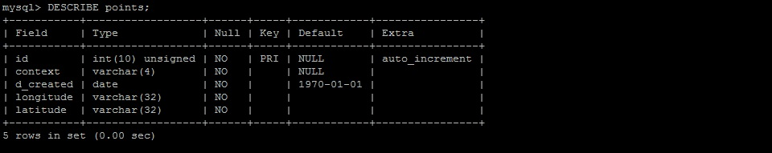
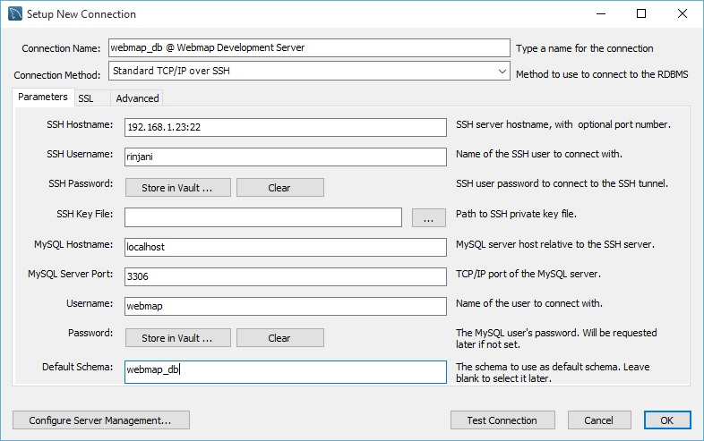

### Part 5: Configuring MySQL Database

Berikut ini adalah langkah-langkah konfigurasi **MySQL Database** setelah prosedur instalasinya selesai dilaksanakan pada [Part 1](./README.md). Tapi sebelumnya, ada baiknya juga Anda _download_ dulu contoh datanya, dengan _command_:

  ```
  [rinjani@nusantara ~]$ wget https://raw.githubusercontent.com/andyprasetya/webmap-development-server/master/files/sampledata.sql
  ```
  
  Alternatif:
  ```
  [rinjani@nusantara ~]$ wget https://gitlab.com/andyprasetya/missing-files/raw/master/files/sampledata.sql
  ```
  
  Pastikan file ini berada di direktori **```/home/rinjani```**, dan nanti akan kita gunakan untuk contoh data di **MySQL**.
  
#### 1. MySQL Community Server

  ##### 1.1. _Enable_ dan _start_ MySQL sebagai _daemon_ (systemd)
  
  Langkah awal yang harus kita lakukan adalah _enable service_-nya, dan langsung di-_start_:
  
  ```
  [rinjani@nusantara ~]$ sudo systemctl enable mysqld.service
  
  [rinjani@nusantara ~]$ sudo systemctl start mysqld.service
  ```
  
  ##### 1.2. Mengganti _root password_
  
  Saat pertama kali dijalankan, **MySQL Community Server** akan membuat _temporary password_ untuk **root** (administrator) _user_-nya. Kita harus mengganti _password_ ini, dengan _login_ sebagai **root** dengan _temporary password_ yang bisa kita lihat di log-nya dengan menjalankan _shell command_:
  
  ```
  [rinjani@nusantara ~]$ sudo grep 'A temporary password is generated for root@localhost' /var/log/mysqld.log | tail -1
  ```
  
  _Temporary password_-nya akan terlihat seperti pada gambar berikut:
  
  
  
  Selanjutnya _login_ sebagai **root**:
  
  ```
  [rinjani@nusantara ~]$ mysql -u root -p
  ```
  
  Masukkan _temporary password_ tersebut, dan Anda akan langsung masuk ke _shell_ **MySQL Client**. Jalankan _queries_ berikut ini untuk mengganti _password_ **root**-nya:
  
  ```
  mysql> ALTER USER 'root'@'localhost' IDENTIFIED WITH mysql_native_password BY '__password__';
  
  mysql> FLUSH PRIVILEGES;
  ```
  
  > _Password_ sebaiknya **minimal 8 karakter** dan mengandung kombinasi dari _upper_ [A-Z] dan _lower_ [a-z] _case characters_, numerik [0-9] dan alphanumerik [!@#$%^&*()-_=+]. Misal: **```EPeEsGe!4326```**.
  
  Sebagai catatan, _query_ di atas masih menggunakan **mysql_native_password** untuk mendukung kompatibilitas dengan MySQL _driver_ versi sebelum 8.0. Jika Anda yakin benar bahwa yang akan mengakses pasti menggunakan _driver_ versi 8.0 atau yang lebih baru, _query_-nya:
  
  ```
  mysql> ALTER USER 'root'@'localhost' IDENTIFIED BY '__password__';
  
  mysql> FLUSH PRIVILEGES;
  ```
  
  ##### 1.3. _Create user_
  
  Melanjutkan penggantian _password_ untuk **root**, langsung saja Anda _create user_ untuk mengakses MySQL dengan _queries_:
  
  ```
  mysql> CREATE USER 'webmap'@'localhost' IDENTIFIED WITH mysql_native_password BY '__password__';
  
  mysql> FLUSH PRIVILEGES;
  
  mysql> CREATE USER 'webmap'@'%' IDENTIFIED WITH mysql_native_password BY '__password__';
  
  mysql> FLUSH PRIVILEGES;
  ```
  
  atau:
  
  ```
  mysql> CREATE USER 'webmap'@'localhost' IDENTIFIED BY '__password__';
  
  mysql> FLUSH PRIVILEGES;
  
  mysql> CREATE USER 'webmap'@'%' IDENTIFIED BY '__password__';
  
  mysql> FLUSH PRIVILEGES;
  ```
  
  Mengapa pada contoh di atas _create user_-nya 2X? **```'webmap'@'localhost'```** untuk akses dari _localhost_/mesin yang sama, dan **```'webmap'@'%'```** untuk akses dari _host_/mesin lain.
  
  ##### 1.4. _Create database_
  
  Selanjutnya, _create database_ dengan nama **webmap_db** (sama dengan nama _database_ di PostgreSQL, untuk memudahkan dalam mengingatnya saja) dengan menjalankan _query_:
  
  ```
  mysql> CREATE DATABASE webmap_db;
  ```
  
  ##### 1.5. Pengaturan akses untuk user
  
  Setelah _database_-nya Anda _create_, lakukan pengaturan akses untuk _user_ (webmap):
  
  ```
  mysql> GRANT ALL PRIVILEGES ON webmap_db.* TO 'webmap'@'localhost';
  
  mysql> FLUSH PRIVILEGES;
  
  mysql> GRANT ALL PRIVILEGES ON webmap_db.* TO 'webmap'@'%';
  
  mysql> FLUSH PRIVILEGES;
  ```
  
  Dalam pengaturan akses ini, ya harus dilakukan 2X, karena dalam MySQL **```'webmap'@'localhost'```** dan **```'webmap'@'%'```** adalah 2 user yang berbeda.
  
  > _Kenapa_ banyak **```FLUSH PRIVILEGES;```**-nya ya? Ya biar pasti saja hasilnya. Kadang MySQL _lemot_ dalam meng-_update user privileges_-nya. Hahahaha...
  
  ##### 1.6. Importing contoh data ke database
  
  Kalau di bagian awal tadi Anda telah melaksanakan _download_ contoh data untuk MySQL, maka berikut ini adalah langkah-langkah _importing_ datanya ke database **webmap_db**:
  
  ```
  (...masih melanjutkan dari bagian sebelumnya...)
  
  mysql> USE webmap_db;
  
  mysql> source /home/rinjani/sampledata.sql;
  ```
  
  Tunggu hingga selesai, dan kini _database_ **webmap_db** Anda sudah memiliki 1 contoh _table_, yaitu **points**. Langsung saja di-_test_:
  
  ```
  mysql> SHOW TABLES;
  ```
  
  
  
  ```
  mysql> DESCRIBE points;
  ```
  
  
  
  ```
  mysql> SELECT * FROM points LIMIT 10 OFFSET 500;
  ```
  
  
  
  Anda dapat mencoba dengan _query_ yang lain, untuk mencoba _table_ **points** ini. Jika Anda hendak keluar dari MySQL _console_, jalankan:
  
  ```
  mysql> QUIT;
  ```
  
  Sehingga _shell_-nya kembali menjadi:
  
  ```
  [rinjani@nusantara ~]$ 
  ```
  
  ##### 1.7. Membuka port di firewalld
  
  Jika Anda menghendaki MySQL-nya bisa diakses dari mesin lain (asumsi: tanpa menggunakan koneksi _via_ **SSH**), port **3306**-nya (port _default_-nya MySQL) dibuka dengan _commands_:
  
  ```
  [rinjani@nusantara ~]$ sudo firewall-cmd --permanent --zone=FedoraServer --add-port=3306/tcp
  
  [rinjani@nusantara ~]$ sudo firewall-cmd --reload
  ```
  
  Tapi membuka port 3306 di firewalld ini **tidak disarankan**, lebih baik diakses via SSH saja. Ini yang pada bagian berikutnya akan kita bahas.
  
#### 2. MySQL Workbench

  Sedikit mengulas _DB manager_ untuk MySQL yang _support_ koneksi _via_ **SSH**, kita bisa menggunakan **MySQL Workbench**, yang bisa di-_download_ di [**_download page_**]()-nya ini.
  
  Setelah instalasinya selesai, _create connection_ ke server dengan meng-klik _button_ **[+]**, seperti pada berikut:
  
  
  
  Dialog **Setup New Connection** muncul, isi **Connection Name**: **webmap_db @ Webmap Development Server**, dan pada _drop-down_ **Connection Method** pilih **Standard TCP/IP over SSH**:
  
  
  
  Kemudian lanjutkan dalam _tab_ **Parameters**, isikan **SSH Hostname**: **192.168.1.23:22** (port **22** adalah _default port_ untuk SSH), dan **SSH Username**: **rinjani**.
  
  Untuk koneksi ke MySQL-nya, ubah _entry_ **127.0.0.1** menjadi **localhost** pada **MySQL Hostname**, **MySQL Server Port**-nya tetap di **3306**, **Username**: **webmap**, dan **Default Schema** diisi dengan nama _database_ yang akan kita akses, yaitu **webmap_db**.
  
  
  
  Pastikan isian Anda sudah sesuai dengan _environment_ yang Anda miliki, dan akhirnya klik **OK**.
  
  Untuk memulai koneksi, _double-click_ pintasan yang ada, seperti pada gambar berikut (_box_ merah):
  
  
  
  Pertama kali yang muncul adalah Anda akan diminta untuk mengisi _password user_ SSH-nya, yang dalam contoh ini adalah _password_-nya **rinjani**.
  
  
  
  Setelah sukses login _via_ SSH, baru Anda diminta untuk mengisi _password user_ **webmap** untuk masuk ke MySQL-nya.
  
  
  
  Akhirnya, **MySQL Workbench** Anda sudah terhubung ke _database_ **webmap_db**, dan Anda dapat melakukan operasi-operasi _database_ sesuai kebutuhan Anda.
  
  
  
Sampai tahap ini, Anda berarti sudah memiliki 2 database server yang berjalan, yaitu **PostgreSQL/PostGIS** dan **MySQL Community Server**. Selanjutnya, kita akan membahas komponen-komponen yang terkait-erat dengan webmap _frontend development_. Terima kasih sudah bersabar mengikuti tutorial ini!

> Instalasi dan konfigurasi sebuah _tech-stack_ adalah sebuah _craftmanship_ -- semakin mendalam Anda menggali bagaimana sebuah komponen bekerja dalam ekosistemnya, _in-and-out_, maka semakin paham pula Anda terhadap seluruh ketidaksempurnaan yang pernah Anda jumpai dalam hidup.

### Related parts:
  * [Part 1](./README.md): Post-Installation / OS Configuration
  * [Part 2](./fedora-geostack-part-2-apache-tomcat.md): Configuring Apache Tomcat for GeoServer
  * [Part 3](./fedora-geostack-part-3-geoserver.md): GeoServer Installation / Configuration
  * [Part 4](./fedora-geostack-part-4-postgis.md): Configuring PostgreSQL and PostGIS
  * Part 5: Configuring MySQL Database (this file)
  * [Part 6](./fedora-geostack-part-6-php-nginx.md): Configuring PHP, PHP-FPM and Nginx
  * [Part 7](./fedora-geostack-part-7-reverse-proxy.md): Configuring Nginx as a Reverse-Proxy
  * [Part 8](./fedora-geostack-part-8-ftp.md): Configuring Pure-FTPd
