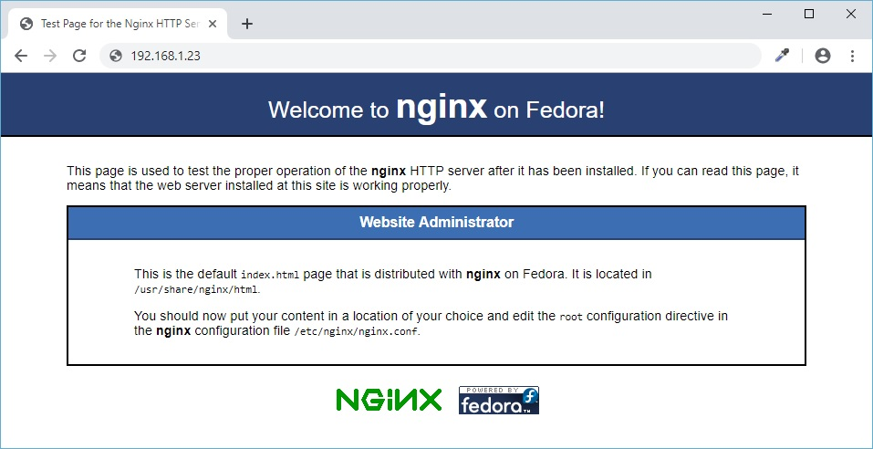

## Part 6: Configuring PHP, PHP-FPM and Nginx

Salah-satu komponen yang dapat menjembatani webmap frontend (tentu saja ini: HTML) dengan database yang paling populer adalah PHP. Pada bagian ini kita akan membahas tentang bagaimana konfigurasinya dan bagaimana menghubungkannya dengan HTTP server yang akan kita gunakan, yaitu Nginx.

> Sedikit OOT, banyak developer (yang biasanya saat ini -- tahun 2019 -- \< 30) yang memandang-rendah terhadap PHP. Issue yang kebanyakan mereka angkat adalah performa (terutama pada saat sistemnya diakses oleh ratusan, ribuan, bahkan jutaan users). Dan masih banyak lagi issues lain yang dimanfaatkan oleh para PHP-haters itu untuk bad-mouthing about PHP di Internet.

> Tapi bagi saya (saya berharap Anda juga) tidak. Saya bukan PHP-hater. Saya jadi PHP-user saja. (Webmap) development pada prinsipnya adalah proses penyelesaian masalah, yang mana hasil akhirnya adalah sebuah solusi. PHP (dan sama juga dengan bahasa-bahasa pemrograman lainnya) itu pada akhirnya hanya menjadi sebuah alat untuk mencapai tujuan akhir. Pada prosesnya, yang penting juga bukan PHP-nya juga koq, tapi arsitektur dan algoritma yang diterapkan dalam setiap business logic-nya, bahkan hingga komponen terkecil dan paling sederhana sekalipun. Saya nggak malu pakai PHP, karena saya pikir reputasi saya akan lebih memalukan lagi jika webmap saya nggak jalan.

Stop OOT-nya, langsung mulai kerja saja. Asumsikan saja Anda sudah login ke server sebagai rinjani melalui SSH dari workstation Anda:

### 1. _Editing_ php.ini file

  Langkah pertama adalah membuat direktori untuk penampungan **PHP_SESSION** _files_, dan diikuti dengan mengedit file ```php.ini``` yang _by default_ berada di direktori ```/etc```. _Commands_-nya:
  
  ```
  [rinjani@nusantara ~]$ sudo mkdir /tmp/phpsessions
  
  [rinjani@nusantara ~]$ sudo chmod -R 777 /tmp/phpsessions
  
  [rinjani@nusantara ~]$ sudo nano /etc/php.ini
  ```
  
  > Sebagai catatan, pada file ```php.ini```, comments selalu diawali dengan karakter **;** (titik-koma / _semicolon_).
  
  Tambahkan, atau ganti _values_ pada _entries_ berikut ini, yang akan ditampilkan dalam sebuah _table_:
  
  Entry/Setting | Default/Old Value | New Value | Comments
  ------------- | ----------------- | --------- | --------
  **expose_php** | ```On``` | ```Off``` | -
  **error_reporting** | ```E_ALL & ~E_DEPRECATED & ~E_STRICT``` | ```E_ALL``` | -
  **post_max_size** | ```2M``` | ```200M``` | -
  **upload_max_filesize** | ```2M``` | ```200M``` | -
  **date.timezone** | ```disabled, empty``` | ```"Asia/Jakarta"``` | ```uncomment```
  **pdo_mysql.default_socket** | ```empty``` | ```/var/lib/mysql/mysql.sock``` | -
  **mysql.default_port** | ```empty``` | ```3306``` | -
  **mysql.default_socket** | ```empty``` | ```/var/lib/mysql/mysql.sock``` | -
  **mysql.default_host** | ```empty``` | ```localhost``` | -
  **mysqli.default_socket** | ```empty``` | ```/var/lib/mysql/mysql.sock``` | -
  **mysqli.default_host** | ```empty``` | ```localhost``` | -
  **session.save_path** | ```disabled, empty``` | ```"/tmp/phpsessions"``` | ```uncomment```
  
  Misal:
  
  ```
  ...
  ;date.timezone = 
  ...
  ```
  
  menjadi:
  
  ```
  ...
  date.timezone = "Asia/Jakarta"
  ...
  ```
  
  Dan misal:
  
  ```
  ...
  mysql.default_socket = 
  ...
  ```
  
  menjadi:
  
  ```
  ...
  mysql.default_socket = /var/lib/mysql/mysql.sock
  ...
  ```
  
  > Jadi, ada values yang pakai **"..."** (petik-ganda / _double-quotes_), dan ada yang tidak. Cermati format _values_-nya.
  
  _Save_ perubahannya dengan menekan **Ctrl+O** lalu **\<Enter\>** untuk mengkonfirmasi **Yes**, dan _exit_ dari **_nano editor_** dengan menekan **Ctrl-X**.
  
### 2. PHP-FPM (PHP FastCGI Process Manager)

  Setelah file ```php.ini``` diedit, maka **PHP-FPM**-nya harus diaktifkan lewat **systemd**:
  
  ```
  [rinjani@nusantara ~]$ sudo systemctl enable php-fpm.service
  
  [rinjani@nusantara ~]$ sudo systemctl start php-fpm.service
  ```
  
  _Test_ PHP-nya dengan _commands_ berikut ini:
  
  ```
  [rinjani@nusantara ~]$ php --ri pgsql
  
  [rinjani@nusantara ~]$ php --ri mysqli
  
  [rinjani@nusantara ~]$ php --ri gd
  
  [rinjani@nusantara ~]$ php --ri gmp
  
  [rinjani@nusantara ~]$ php --ri json
  
  [rinjani@nusantara ~]$ php --ri session
  
  [rinjani@nusantara ~]$ php --ri sqlite3
  
  [rinjani@nusantara ~]$ php --ri exif
  ```
  
  Kalau _tests_ di atas sudah menampilkan informasi bahwa modul-modul tersebut _support_-nya _enabled_, maka PHP Anda sudah siap.
  
### 3. _Editing_ nginx.conf file

  Setting ```php.ini``` memang _njlimet_ (rumit). Yang berikut ini bakalan lebih _njlimet_ lagi, yaitu setting Nginx pada file ```nginx.conf```:
  
  ```
  [rinjani@nusantara ~]$ sudo nano /etc/nginx/nginx.conf
  ```
  
  Yang diedit/ditambah adalah:
  
  #### 3.1. types_hash_max_size
  
  Yang tadinya:
  
  ```
  ...
  types_hash_max_size 2048;
  ...
  ```
  
  menjadi:
  
  ```
  ...
  types_hash_max_size 4096;
  ...
  ```
  
  #### 3.2. client_max_body_size
  
  Tambahkan _entry_ ```client_max_body_size``` di bawah ```types_hash_max_size``` supaya _user_ bisa meng-_upload file_ hingga **200 MB**:
  
  ```
  ...
  types_hash_max_size 4096;
  client_max_body_size 200m;
  ...
  ```
  
  #### 3.3. index
  
  Masuk ke blok ```server { ... }```, ubah index yang tadinya:
  
  ```
  ...
  root /usr/share/nginx/html;
  index index.html index.htm;
  ...
  ```
  
  menjadi:
  
  ```
  ...
  root /usr/share/nginx/html;
  index index.php index.html index.htm;
  ...
  ```
  
  #### 3.4. PHP FastCGI
  
  Sambil mulai membahas strategi reverse-proxy pada Nginx, masih di blok ```server { ... }```, tambahkan:
  
  ```
  ...
  proxy_buffering     off;
  proxy_buffer_size   128k;
  proxy_buffers       128k;
  ...
  ```
  
  sebagai proxy buffer directives yang berlaku secara global.
  
  Kemudian tambahkan directives untuk PHP FastCGI-nya:
  
  ```
  ...
  location / {
  }
  ...
  ```
  
  menjadi:
  
  ```
  ...
  location / {
  }

  location ~ [^/]\.php(/|$) {
    try_files $uri =404;
    fastcgi_split_path_info ^(.+?\.php)(/.*)$;
    if (!-f $document_root$fastcgi_script_name) {
      return 404;
    }
    fastcgi_param HTTP_PROXY "";
    fastcgi_pass 127.0.0.1:9000;
    fastcgi_index index.php;
    include fastcgi_params;
    fastcgi_param  SCRIPT_FILENAME   /usr/share/nginx/html$fastcgi_script_name;
  }
  ...
  ```
  
  Dan akhirnya tambahkan directives berikut ini di akhir blok ```server { ... }```:
  
  ```
  ...
  location ~ /\.ht {
    deny all;
  }
  ...
  ```
  
  _Save_ perubahannya dengan menekan **Ctrl+O** lalu **\<Enter\>** untuk mengkonfirmasi **Yes**, dan _exit_ dari **_nano editor_** dengan menekan **Ctrl-X**.
  
  #### 3.5. systemd dan firewalld untuk Nginx
  
  Untuk mengaktifkan Nginx sebagai service, jalankan commands:
  
  ```
  [rinjani@nusantara ~]$ sudo chmod -R 777 /usr/share/nginx/html
  
  [rinjani@nusantara ~]$ sudo systemctl enable nginx.service
  
  [rinjani@nusantara ~]$ sudo firewall-cmd --permanent --zone=FedoraServer --add-port=80/tcp
  
  [rinjani@nusantara ~]$ sudo firewall-cmd --reload
  
  [rinjani@nusantara ~]$ sudo firewall-cmd --permanent --zone=FedoraServer --add-port=443/tcp
  
  [rinjani@nusantara ~]$ sudo firewall-cmd --reload
  
  [rinjani@nusantara ~]$ sudo systemctl restart php-fpm.service
  
  [rinjani@nusantara ~]$ sudo systemctl start nginx.service
  ```
  
  Buka URL **```http://192.168.1.23```** di browser Anda, maka Nginx _test page_ akan muncul.
  
  

### 4. phpinfo()

  --
  
### 5. PHP and Modern API-Style

  --
  
