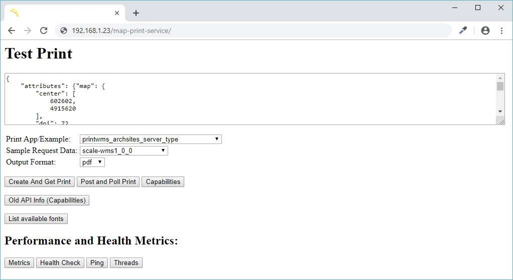

## Part 7: Configuring Nginx as a Reverse-Proxy

Kalau pada [**Part 6**](./fedora-geostack-part-6-php-nginx.md) kita sudah berkenalan dengan strategi _reverse-proxy_, maka berikut ini kita akan me-_reverse-proxy_ **GeoServer** dan **MapFish Print** supaya mengaksesnya jadi lebih nyaman dan URL-nya juga bisa mengikuti maunya _modern API-style_.

Langkahnya sangat sederhana, yaitu edit saja file ```nginx.conf``` dengan memasukkan _directives_ untuk _reverse-proxy_.

  ```
  [rinjani@nusantara ~]$ sudo systemctl stop nginx.service
  
  [rinjani@nusantara ~]$ sudo nano /etc/nginx/nginx.conf
  ```
  
  dan tambahkan _directives_ berikut dalam blok ```server { ... }```:
  
  ```
  # GeoServer Reverse-Proxy
  location /geoserver {
    proxy_pass http://127.0.0.1:8080/geoserver;
    proxy_set_header Host $host;
    proxy_set_header X-Real-IP $remote_addr;
    proxy_set_header X-Forwarded-For $proxy_add_x_forwarded_for;
    proxy_redirect off;
  }
  
  # MapFish Print Service Reverse-Proxy
  location /map-print-service {
    proxy_pass http://127.0.0.1:8080/map-print-service;
    proxy_set_header Host $host;
    proxy_set_header X-Real-IP $remote_addr;
    proxy_set_header X-Forwarded-For $proxy_add_x_forwarded_for;
    proxy_redirect off;
  }
  ```
  
  _Save_ perubahannya dengan menekan **Ctrl+O** lalu **\<Enter\>** untuk mengkonfirmasi **Yes**, dan _exit_ dari **_nano editor_** dengan menekan **Ctrl-X**.
  
  > Untuk lebih lengkapnya, Anda bisa melihat contoh [**nginx.conf**](./files/nginx-reverse-proxy.conf) ini.
  
  Selanjutnya, _start_ Nginx-nya lagi:
  
  ```
  [rinjani@nusantara ~]$ sudo systemctl start nginx.service
  ```
  
  Dan akses URL ```http://192.168.1.23/geoserver``` dan ```http://192.168.1.23/map-print-service``` di _browser_ Anda.
  
  
  
  
  
Cukup mudah dipahami konsepnya, bukan? Selanjutnya, jika akan mengakses **GeoServer** dan **MapFish Print** (baik melalui browser maupun dalam pemrograman webmap), Anda sudah tidak perlu lagi mencantumkan **:8080** atau teknisnya: mengakses **Apache Tomcat**-nya secara langsung. Dengan memanfaatkan strategi _reverse-proxy_, maka **Apache Tomcat** akan bekerja secara lebih terisolasi karena berada _"di belakang"_ **Nginx**.

> Instalasi dan konfigurasi sebuah _tech-stack_ adalah sebuah _craftmanship_ -- semakin mendalam Anda menggali bagaimana sebuah komponen bekerja dalam ekosistemnya, _in-and-out_, maka semakin paham pula Anda terhadap seluruh ketidaksempurnaan yang pernah Anda jumpai dalam hidup.

### Related parts:
  * [Part 1](./README.md): Post-Installation / OS Configuration
  * [Part 2](./fedora-geostack-part-2-apache-tomcat.md): Configuring Apache Tomcat for GeoServer
  * [Part 3](./fedora-geostack-part-3-geoserver.md): GeoServer Installation / Configuration
  * [Part 4](./fedora-geostack-part-4-postgis.md): Configuring PostgreSQL and PostGIS
  * [Part 5](./fedora-geostack-part-5-mysql.md): Configuring MySQL Database
  * [Part 6](./fedora-geostack-part-6-php-nginx.md): Configuring PHP, PHP-FPM and Nginx
  * Part 7: Configuring Nginx as a Reverse-Proxy (this file)
  * [Part 8](./fedora-geostack-part-8-ftp.md): Configuring Pure-FTPd
